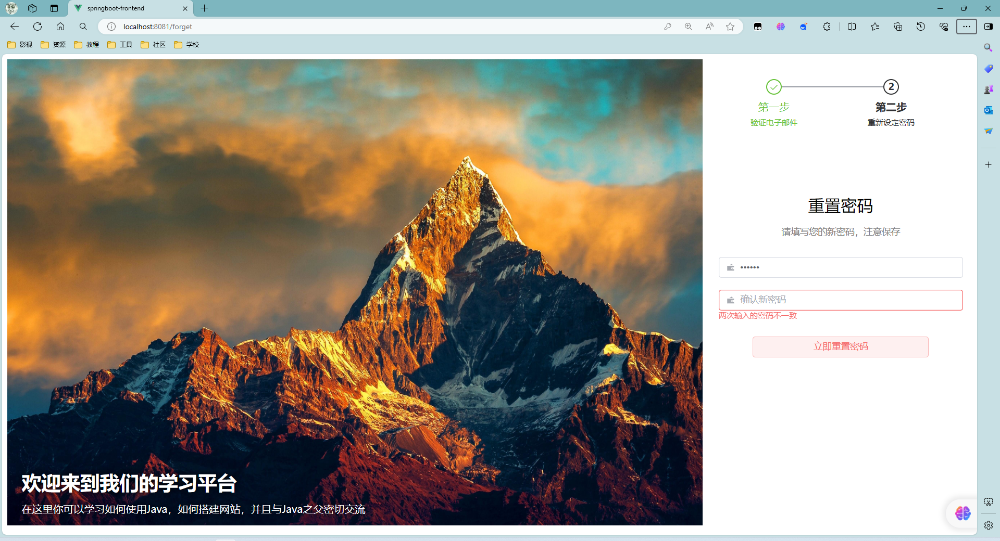

# SpringBoot-Vue

#### 介绍
基于SpringBoot+Vue+Element-plus+Session校验的前后端分离项目

#### 软件架构
* 登录功能（支持用户名、邮箱登录）

---
* 注册用户（通过邮箱注册）

---
* 重置密码（通过邮箱重置）

#### 安装教程
1. 开发环境：Windows 11
2. 开发工具：IDEA 2021 (Ultimate)
3. JDK版本：17.0.10
4. 构建工具：Maven 3.6.3
5. 数据库版本：MySQL 8.0，Redis 3.0.504
6. 数据库连接工具：Navicat For MySQL 10.1.7， AnotherRedisDesktopManager 1.4.8
7. 服务器：SpringBoot内置服务器
8. 调试工具：Microsoft Edge

#### 使用说明

* 登录功能：
  1. 用户登录成功后才能访问index路径下的页面
  2. 用户如果没有登录，那么会自动跳转到登录界面
  3. 未登录的请求，则跳转到登录页；若已登录则跳转首页

* 登录解决方案
  1. 无论是否已经登录，直接向后端请求用户信息
  2. 若请求成功，说明已经登录
  3. 若请求失败，说明未登录，直接跳转到登录页
#### 参与贡献

subpyte：2219084706@qq.com

#### 特技

1.  使用 Readme\_XXX.md 来支持不同的语言，例如 Readme\_en.md, Readme\_zh.md
2.  Gitee 官方博客 [blog.gitee.com](https://blog.gitee.com)
3.  你可以 [https://gitee.com/explore](https://gitee.com/explore) 这个地址来了解 Gitee 上的优秀开源项目
4.  [GVP](https://gitee.com/gvp) 全称是 Gitee 最有价值开源项目，是综合评定出的优秀开源项目
5.  Gitee 官方提供的使用手册 [https://gitee.com/help](https://gitee.com/help)
6.  Gitee 封面人物是一档用来展示 Gitee 会员风采的栏目 [https://gitee.com/gitee-stars/](https://gitee.com/gitee-stars/)
